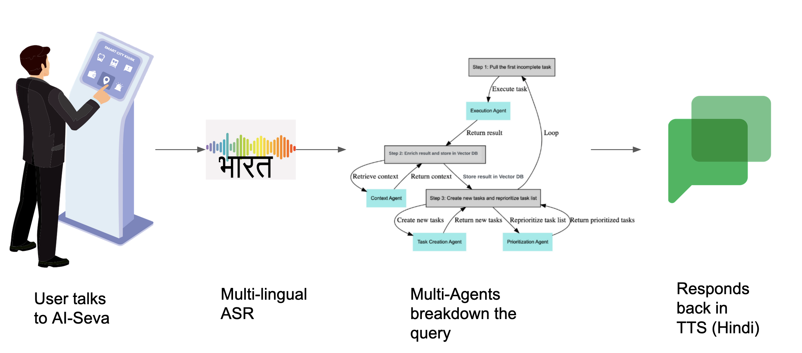
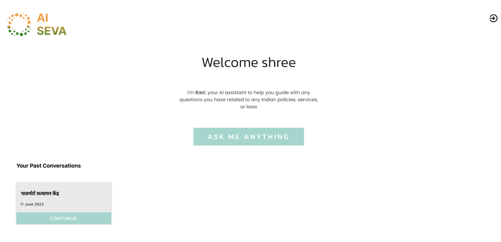
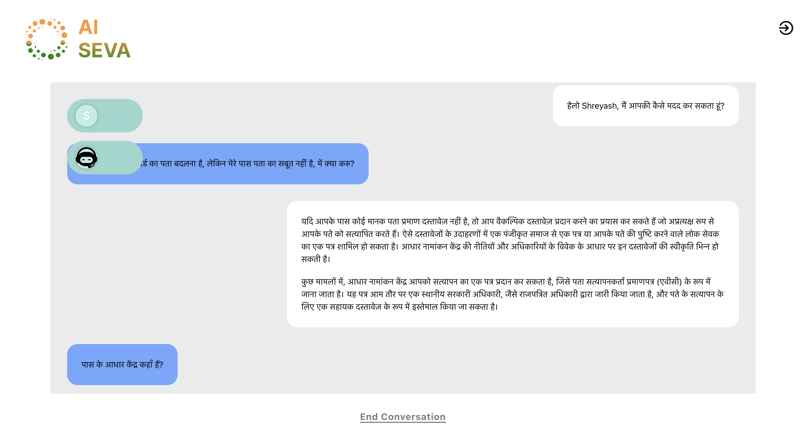

# AI-seva
Agents based multi-lingual AI-seva kendra for helping you navigate government resources

Part of 2 day GenAI hackathon, organsied by [Stellaris Venture Partners](https://lu.ma/ucd44q8e)

### How it works

You can add your documents under "backend/src/static" to give context

### Setup 
It runs with reactjs as frontend and fast api backend. 
Check inside the respective folders

### Screenshots

